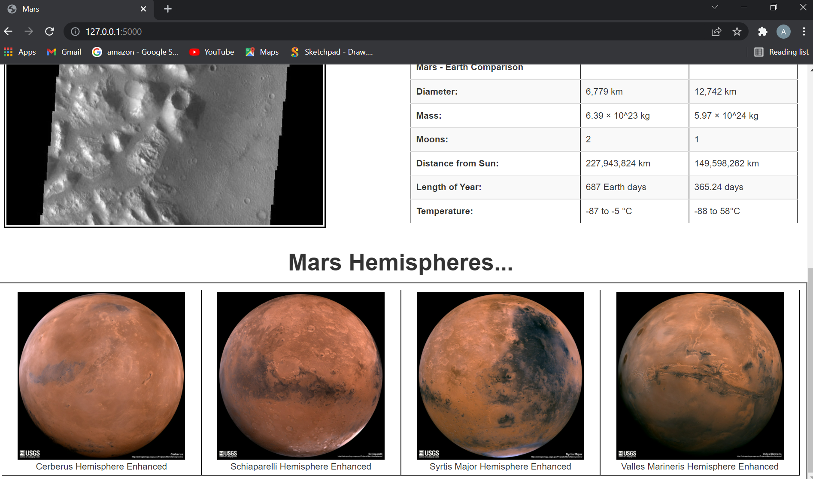

# Web-scraping-challenge

Build a web application that scrapes various websites for data related to the Mission to Mars and displays the information in a single HTML page. 

Initial analysis was performed in a jupyter notebook [mission_to_mars](./Mission_to_Mars/mission_to_mars.ipynb). The main code is within a sub folder called [Mission_to_Mars](./Mission_to_Mars) A number of modules were utilised including Splinter, Requests, BeautifulSoup, ChromeDriverManager, Flask and PyMongo.

Screenshots of the final application can be found in the folder.

